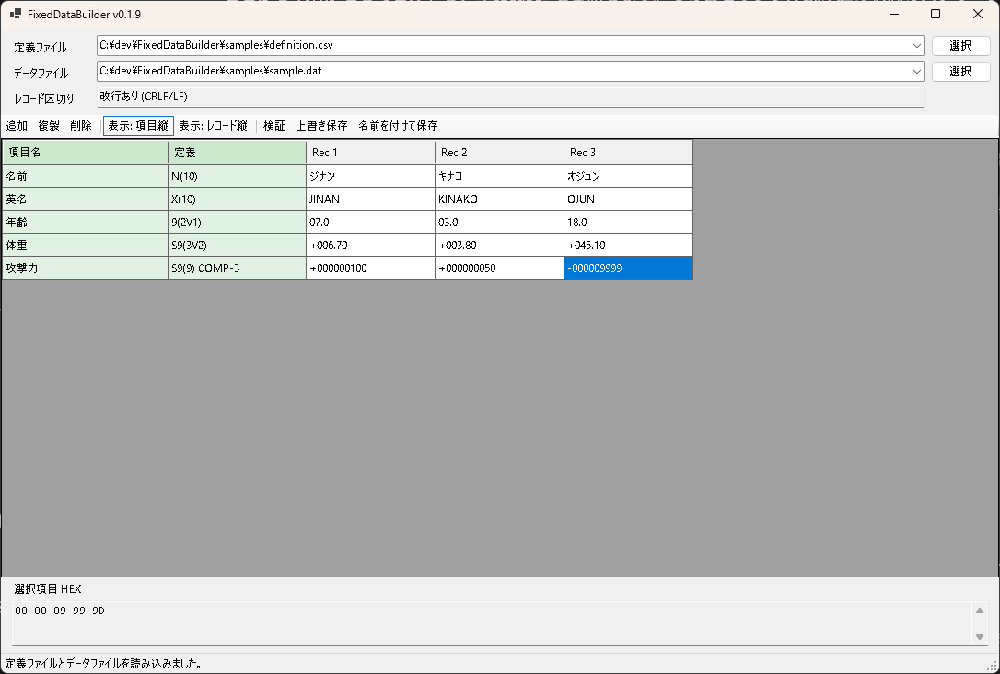

# FixedDataBuilder

FixedDataBuilder は、COBOL 固定長データのテストデータを作成・編集するための C# WinForms ツールです。

定義書 CSV を読み込み、項目とレコードを表形式で見比べながら編集します。PAC/packed decimal 項目は画面上では通常の数値として入力し、保存時に packed decimal のバイト列へ変換します。

## 画面イメージ



項目縦表示とレコード縦表示を切り替えできます。

## 定義書 CSV

UTF-8 CSV を想定しています。基本形式は `項目名,定義` の 2 列です。

```csv
項目名,定義
名前,N(10)
英名,X(10)
年齢,9(2V1)
体重,S9(3V2)
攻撃力,S9(9) COMP-3
```

対応している COBOL 表記:

- `9(n)`: 平数字
- `X(n)`: 文字。Shift_JIS の n バイト領域
- `N(n)`: 文字_全角。全角 n 文字領域
- `9(nVm)`: 小数桁つき平数字。画面では小数点つきで入力し、保存時は小数点なしの桁列
- `S9(nVm)`: 小数桁つき符号あり数字
- `S9(n) COMP-3`: PAC_符号あり
- `9(n) COMP-3`: PAC_符号なし

`samples/definition.csv` にサンプル定義書、`samples/sample-records.csv` に画面入力値のサンプルがあります。

## 現在の MVP

- WinForms/.NET 8 プロジェクト
- 定義書 CSV 読み込み
- COBOL 表記の簡易解析
- 空レコード作成
- 項目縦表示 / レコード縦表示の切り替え
- レコード追加、複製、削除
- セル編集
- 型/桁数の簡易検証
- 数値のゼロ埋め表示と符号表示
- Shift_JIS 前提の固定長データ保存
- PAC の暫定エンコード

## ビルド済み exe

`release/FixedDataBuilder.exe` に Release ビルド済みの実行ファイルを配置しています。

## 今後の対応予定

- 固定長データ読み込み
- レコード区切りの選択
- 定義書フォーマットの追加対応
- `X(n)` と全角文字項目の扱いの詳細化
- PAC の符号ニブル、桁数、端数ルールの詳細確認と設定化
- HEX 表示
- セル単位の検証表示
- サンプルデータの読み書きテスト追加
