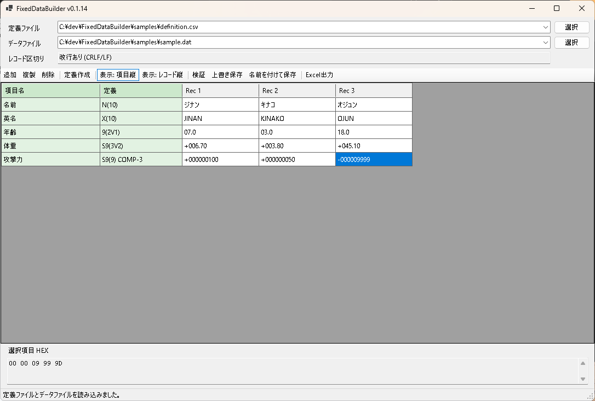

# FixedDataBuilder

FixedDataBuilder は、COBOL 固定長データのテストデータを作成・編集するための C# WinForms / .NET 8 ツールです。

定義書 CSV を読み込み、項目とレコードを表形式で見比べながら編集できます。COMP-3 / packed decimal 項目は、画面上では通常の数値として表示・入力し、保存時に packed decimal のバイト列へ変換します。

## 画面イメージ



項目縦表示とレコード縦表示を切り替えできます。画面上部には選択中の定義ファイルとデータファイルのパスを表示し、最近使ったファイルをそれぞれ直近 20 件まで履歴から選べます。

## ダウンロード

最新版は [GitHub Releases](https://github.com/konikatsu/FixedDataBuilder/releases/latest) からダウンロードできます。

zip を展開して `FixedDataBuilder.exe` を実行してください。zip には `samples/definition.csv`、`samples/sample-records.csv`、`samples/sample.dat` も同梱しています。

## 定義書 CSV

UTF-8 CSV を想定しています。基本形式は `項目名,定義` の 2 列です。

```csv
項目名,定義
名前,N(10)
英名,X(10)
年齢,9(2V1)
体重,S9(3V2)
攻撃力,S9(9) COMP-3
```

対応している COBOL 表記:

- `9(n)`: 符号なし数字
- `S9(n)`: 符号付き数字
- `9(nVm)`: 小数桁付き符号なし数字
- `S9(nVm)`: 小数桁付き符号付き数字
- `X(n)`: 半角文字、Shift_JIS の n バイト領域
- `N(n)`: 全角文字、全角 n 文字領域
- `9(n) COMP-3`: 符号なし packed decimal
- `S9(n) COMP-3`: 符号付き packed decimal

## できること

- 定義書 CSV 読み込み
- 定義書 CSV 作成
- 固定長データ読み込み
- 読み込み時の改行あり / 改行なし選択
- 保存時に読み込み時の改行形式を継承
- 上書き保存 / 名前を付けて保存
- 項目縦表示 / レコード縦表示の切り替え
- レコード追加、複製、削除
- セル編集
- 数値のゼロ埋め表示
- 符号付き数値の符号表示
- 型・桁数の簡易検証
- 検証エラーセルの薄赤表示
- 選択項目の HEX 表示
- 画面表示形式の Excel 出力
- Shift_JIS 前提の固定長データ保存
- `N(n)` の未入力値は全角スペースで保存
- `S9(n)` / `S9(nVm)` の表示数値は末尾桁の ASCII ゾーン符号で保存
- COMP-3 / packed decimal の暫定エンコード・デコード

## サンプル

`samples/definition.csv` と `samples/sample.dat` を読み込むと、以下の 3 レコードを固定長データとして確認できます。

```csv
ジナン,JINAN,7,6.7,100
キナコ,KINAKO,3,3.8,50
オジュン,OJUN,18,45.1,-9999
```

攻撃力は `S9(9) COMP-3` の packed decimal として `sample.dat` に格納しています。

## ビルド済み exe

`release/FixedDataBuilder.exe` に Release ビルド済みの実行ファイルを配置しています。

## 今後の対応予定

- 定義書フォーマットの追加対応
- PAC の符号ニブル、桁数、端数ルールの詳細確認と設定化
- HEX 表示の編集支援
- 検証内容の拡充
