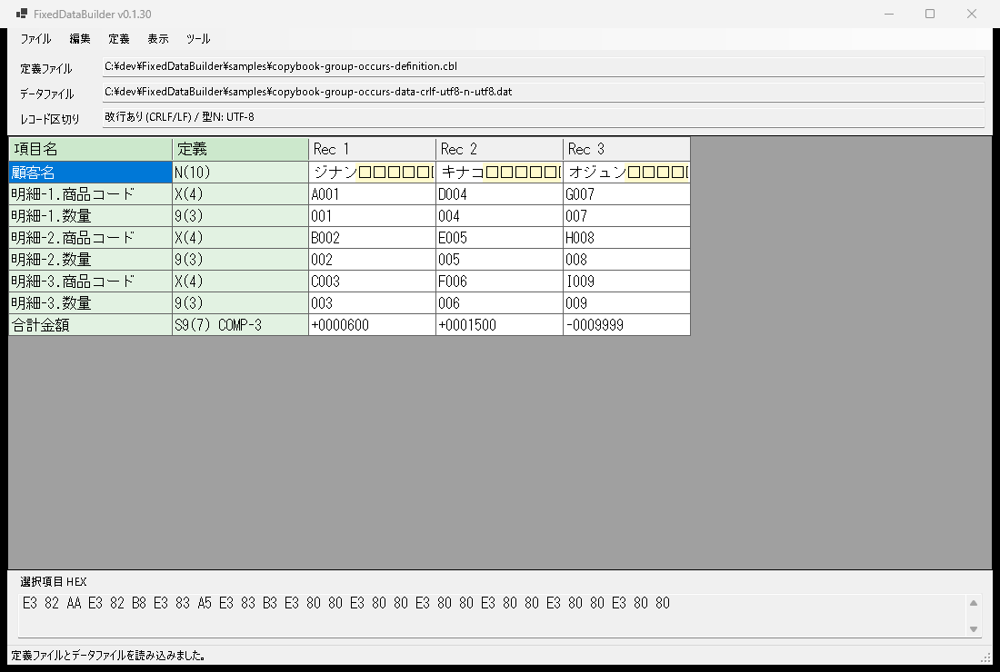
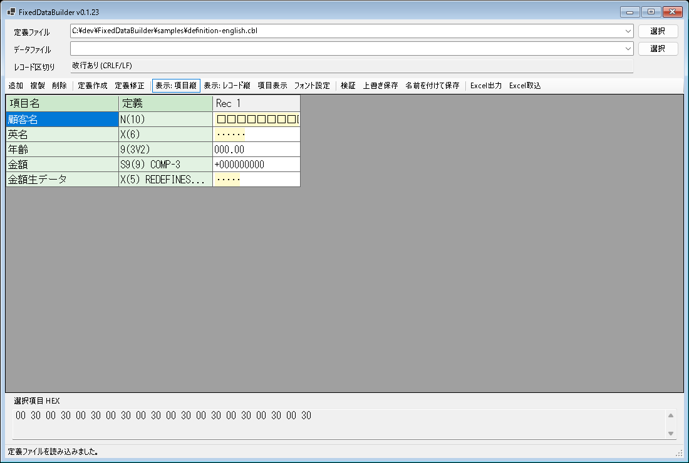
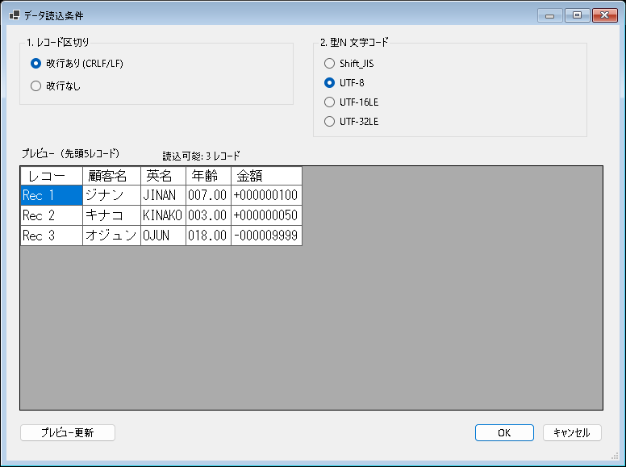

# FixedDataBuilder

FixedDataBuilder は、COBOL 固定長データのテストデータを作成・編集するための C# WinForms / .NET 8 ツールです。

定義書 CSV を読み込み、項目とレコードを表形式で見比べながら編集できます。COMP-3 / packed decimal 項目は、画面上では通常の数値として表示・入力し、保存時に packed decimal のバイト列へ変換します。

## 画面イメージ



項目縦表示とレコード縦表示を切り替えできます。画面上部には選択中の定義ファイルとデータファイルのパスを表示します。最近使ったファイルは `ファイル` メニューから、定義ファイル・データファイルそれぞれ直近 20 件まで選べます。

## ダウンロード

最新版は [GitHub Releases](https://github.com/konikatsu/FixedDataBuilder/releases/latest) からダウンロードできます。

zip を展開して `FixedDataBuilder.exe` を実行してください。zip には `samples/` 配下のサンプル定義・サンプルデータも同梱しています。

## 定義書 CSV / COBOL コピー句

UTF-8 CSV を想定しています。基本形式は `項目名,定義` の 2 列です。

```csv
項目名,定義
名前,N(10)
英名,X(10)
年齢,9(2V1)
体重,S9(3V2)
攻撃力,S9(9) COMP-3
```

COBOL コピー句（`.cbl` / `.cpy`）も定義ファイルとして読み込めます。コピー句ファイルは UTF-8、固定形式の 7 桁目ルールありとして扱います。選択ボタンからコピー句を選ぶと、PIC 句付きの項目を表へ表示します。



```cobol
       01 SAMPLE-RECORD.
          05 名前       PIC N(10).
          05 英名       PIC X(10).
          05 年齢       PIC 9(2)V9(1).
          05 体重       PIC S9(3)V9(2).
          05 攻撃力     PIC S9(9) COMP-3.
```

コピー句読み込みの初期対応範囲:

- `PIC X(n)` / `PIC N(n)`
- `PIC XXXXXX` / `PIC 999V99` のような括弧なし表記
- `PIC 9(n)` / `PIC S9(n)`
- `PIC 9(n)V9(m)` / `PIC S9(n)V9(m)`
- `COMP-3` / `PACKED-DECIMAL`
- 同一 PIC 行の基本項目 `OCCURS n TIMES`
- 集団項目 `OCCURS n TIMES` の限定対応
- `REDEFINES` 配下の `OCCURS`、多重 `OCCURS`、`OCCURS DEPENDING ON` は未対応です
- `REDEFINES` は物理レコード長には加算せず、保存時は重複領域として書き出しません。画面の表示対象からは除外します
- 66 レベル、88 レベルは固定長データ項目ではないため読み飛ばします
- 英字の COBOL 項目名は内蔵辞書で可能な範囲だけ日本語表示名に変換します
- コピー句由来のデータ読み込みでは、X/9/S9/COMP-3 は UTF-8、N 項目はデータ読み込み時に選択した文字コードで読み込みます

対応している COBOL 表記:

- `9(n)`: 符号なし数字
- `S9(n)`: 符号付き数字
- `9(nVm)`: 小数桁付き符号なし数字
- `S9(nVm)`: 小数桁付き符号付き数字
- `X(n)`: 半角文字、Shift_JIS の n バイト領域
- `N(n)`: 全角文字、全角 n 文字領域
- `9(n) COMP-3`: 符号なし packed decimal
- `S9(n) COMP-3`: 符号付き packed decimal

## できること

- 定義書 CSV 読み込み
- 定義書 CSV 作成
- 定義書 CSV 作成時の型選択
- 定義書 CSV 作成時、文字型の小数桁は入力不可
- `定義作成` は空の新規作成、`定義修正` は読み込み済み定義の編集
- 固定長データ読み込み
- 読み込み時の改行あり / 改行なしと型N文字コード選択。`データ読込条件` 画面で、`Shift_JIS` / `UTF-8` / `UTF-16LE` / `UTF-32LE` を選べます。既定値は `Shift_JIS` です
- `データ読込条件` 画面で、選択中の条件によるデータプレビューを確認できます


- 保存時に読み込み時の改行形式を継承
- 上書き保存 / 名前を付けて保存
- 項目縦表示 / レコード縦表示の切り替え
- `項目表示` から、画面に表示する項目を選択できます。非表示にした項目も内部データとしては保持され、保存時のレコード構造からは除外されません
- レコード縦表示時の項目ヘッダーにバイト位置ルーラを表示
- レコード追加、複製、削除
- セル編集
- 表とHEX表示のフォント名・サイズ設定と記憶
- 初期フォントは `MS ゴシック 12pt`
- 数値のゼロ埋め表示
- 符号付き数値の符号表示
- 文字項目で半角スペース・全角スペース・埋めスペースを `･` / `□` で表示し、空白部分だけを薄黄色で表示
- 型・桁数の簡易検証
- 検証エラーセルの薄赤表示
- 選択項目の HEX 表示
- 画面表示形式の Excel 出力
- Excel 出力後に作成したブックを開く
- FixedDataBuilder が出力した Excel の取り込み
- Shift_JIS 前提の固定長データ保存
- `N(n)` の未入力値は全角スペースで保存
- `S9(n)` / `S9(nVm)` の表示数値は末尾桁の ASCII ゾーン符号で保存
- COMP-3 / packed decimal の暫定エンコード・デコード

COMP-3 / packed decimal は、現時点では以下の符号ニブルを前提にしています。

```text
符号付き正数: C
符号付き負数: D
符号なし: F
```

例:

```text
S9(3) COMP-3  +123 -> 12 3C
S9(3) COMP-3  -123 -> 12 3D
9(3)  COMP-3   123 -> 12 3F
```

## サンプル

サンプルは、定義ファイルとデータファイルの先頭名をなるべくそろえています。

### CSV 定義サンプル

まずは `samples/basic-definition.csv` と `samples/basic-data-sjis-crlf.dat` を読み込んでください。Shift_JIS 前提、改行ありの固定長データです。

```csv
ジナン,JINAN,7,6.7,100
キナコ,KINAKO,3,3.8,50
オジュン,OJUN,18,45.1,-9999
```

攻撃力は `S9(9) COMP-3` の packed decimal としてデータファイルに格納しています。旧名の `definition.csv`、`sample.dat`、`sample-shiftjis.dat` も互換用に残しています。

### COBOL コピー句サンプル

コピー句サンプルは、定義ファイル名とデータファイル名の先頭をそろえています。データファイル名の末尾は読み込み条件を表します。

- コピー句ファイルは UTF-8 です
- データファイル名の `crlf` は `改行あり (CRLF/LF)`、`none` は `改行なし` を表します
- データファイル名の `n-utf8` / `n-utf16le` / `n-utf32le` / `n-sjis` は、型N文字コードの選択値を表します
- 以下の表にない組み合わせは、エラーまたは文字化けになります

| 用途 | 定義ファイル | データファイル | 改行区切り | 型N文字コード |
| --- | --- | --- | --- | --- |
| 基本コピー句 | `copybook-basic-definition.cbl` | `copybook-basic-data-crlf-utf8-n-utf8.dat` | 改行あり (CRLF/LF) | UTF-8 |
| 基本コピー句 | `copybook-basic-definition.cbl` | `copybook-basic-data-crlf-utf8-n-utf16le.dat` | 改行あり (CRLF/LF) | UTF-16LE |
| 基本コピー句 | `copybook-basic-definition.cbl` | `copybook-basic-data-none-sjis-n-sjis.dat` | 改行なし | Shift_JIS |
| 基本コピー句 | `copybook-basic-definition.cbl` | `copybook-basic-data-none-utf8-n-utf8.dat` | 改行なし | UTF-8 |
| 基本コピー句 | `copybook-basic-definition.cbl` | `copybook-basic-data-none-utf8-n-utf16le.dat` | 改行なし | UTF-16LE |
| 基本コピー句 | `copybook-basic-definition.cbl` | `copybook-basic-data-none-utf8-n-utf32le.dat` | 改行なし | UTF-32LE |
| 基本項目OCCURS | `copybook-occurs-definition.cbl` | `copybook-occurs-data-crlf-utf8-n-utf8.dat` | 改行あり (CRLF/LF) | UTF-8 |
| 集団項目OCCURS | `copybook-group-occurs-definition.cbl` | `copybook-group-occurs-data-crlf-utf8-n-utf8.dat` | 改行あり (CRLF/LF) | UTF-8 |

基本コピー句サンプルでは、顧客名、英名、年齢、金額の 3 レコードを確認できます。金額は `S9(9) COMP-3` の packed decimal で、3 レコード目は `-9999` です。

基本項目OCCURSサンプルでは、以下のように PIC 付き項目に直接指定された `OCCURS` を展開します。

```cobol
05 ITEM-CODE  PIC X(4) OCCURS 3 TIMES.
05 ITEM-COUNT PIC 9(3) OCCURS 3 TIMES.
```

集団項目OCCURSサンプルでは、以下のように集団項目の配下にあるPIC付き項目を回数分展開します。

```cobol
05 DETAIL OCCURS 3 TIMES.
   10 PRODUCT-CODE PIC X(4).
   10 QUANTITY     PIC 9(3).
```

画面上では、たとえば以下のような項目名になります。

```text
明細-1.商品コード
明細-1.数量
明細-2.商品コード
明細-2.数量
明細-3.商品コード
明細-3.数量
```

`REDEFINES` 配下の `OCCURS`、多重 `OCCURS`、`OCCURS DEPENDING ON` は現時点では未対応です。

旧名の `definition-english.cbl`、`sample-copybook-*.dat` も互換用に残しています。

## ビルド済み exe

`release/FixedDataBuilder.exe` に Release ビルド済みの実行ファイルを配置しています。

## 今後の対応予定

- 定義書フォーマットの追加対応
- COMP-3 / packed decimal の詳細ルール設定
  - 符号ニブルを環境に合わせて選択できるようにする
    - 例: 正数を `C`、負数を `D`、符号なしを `F` として保存する
    - 例: 符号なし COMP-3 でも末尾ニブルを `F` にするか、別のルールにするかを選べるようにする
  - 桁数とバイト数の扱いを画面で確認できるようにする
    - 例: `S9(9) COMP-3` が 5 バイトになることを表示する
    - 例: 奇数桁 / 偶数桁で先頭 0 を補うかどうかを確認できるようにする
  - 小数桁付き COMP-3 の端数処理を選択できるようにする
    - 例: `S9(3V2) COMP-3` に `12.345` を入れたとき、エラーにする / 四捨五入する / 切り捨てる、を選べるようにする
  - 読み込んだバイト列と画面表示値の対応を確認しやすくする
    - 例: packed decimal の元バイト、符号ニブル、画面上の数値を並べて確認できるようにする
- HEX 表示の編集支援
- 検証内容の拡充
